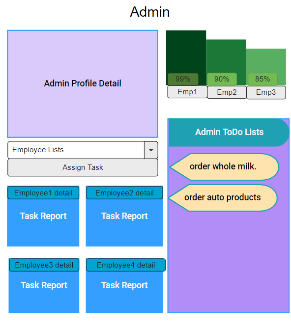
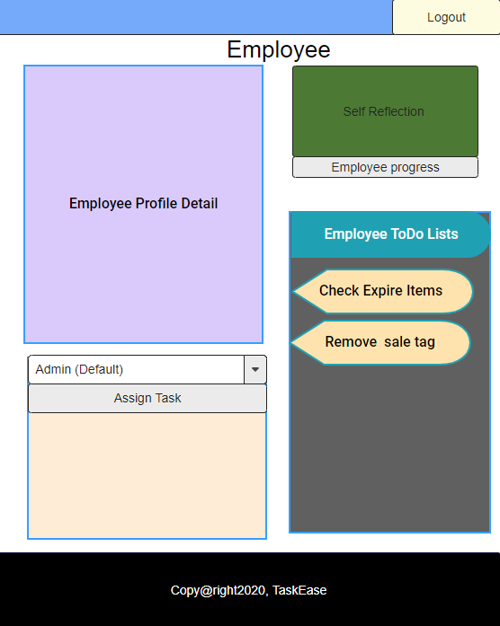
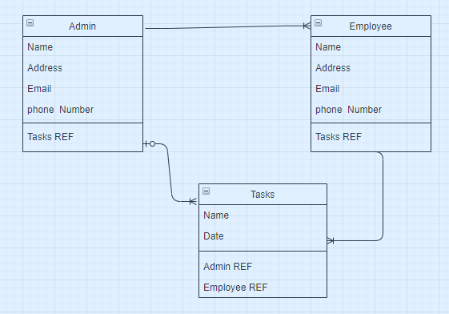

# TaskEase-Client

## About
 ### TaskEase is a task management software that can help an admin to manage the tasks. It tracks resources and progress as well as  helps make decisions when changes are needed. 

## User Stories 

1. Admin can assign a task to employee 
2. Admin can delete and edit a task 
3. Admin can see all complete and incomplete tasks on dashboard.
4. Top 3 employees are visually displayed on Admin dashboard.
5. Admin can edit and delete own profile.
6. Employee can assign a task to admin ( minimum and out products)
7. Employee can not edit and delete a task
8. Employee can not see Admin dashboard
9. Employee can edit own profile
10. Login and signup 

## Wireframe
### Admin Interface
 
### Employee Interface
 

## ERD
 

## Technologies
1. BOOTSTRAP 
2. REACT JS
3. NODE JS 
4. EXPRESS 
5. MONGODB

